# hysAnalyser 

  MPEG-TS analysis，仅支持中文

## 功能概述

  hysAnalyser是一款 MPEG-TS 数据分析和转换工具 ( Github：https://github.com/zymill/hysAnalyser )

  * 1）MPEG-TS离线文件分析（PSI/SI，时间戳、码率、音视频同步，PES列表，RTP封装包列表等）

  * 2）HLS实时流接入（M3u8列表，分片缓存等分析）

  * 3）除主流的MPEG-1/2/4，H.264/AVC、H.265/HEVC外，工具扩展支持了 H.266/VVC, AVS2, AVS3等编码格式 

  * 4）支持分析结果数据的导出，包括PCR，时间戳，码率，时间间距等内容

  * 5）流转换功能：从多节目流按需配置参数提取节目流；

  * 6）高级功能：流编辑修改PID，修改时间戳，修改界面名称，删除指定PID数据，

  可能有些朋友会问，为什么不加上 ES 提取和 ES 分析功能（类似于 flvAnalyser），主要是时间来不及了。flvAnalyser 已有这些功能，如果朋友们迫切需要，可以通过 flvAnalyser 做ES分析。后期再逐步完善和补充。

（提示：部分功能需软件授权后才能使用，授权方法和费用请参考最后说明）

## 图示

### 基本信息

    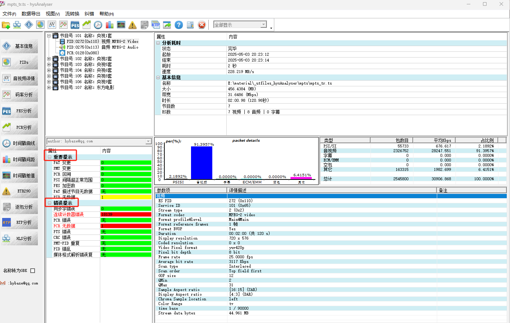

### 逐包分析

* 全量包

    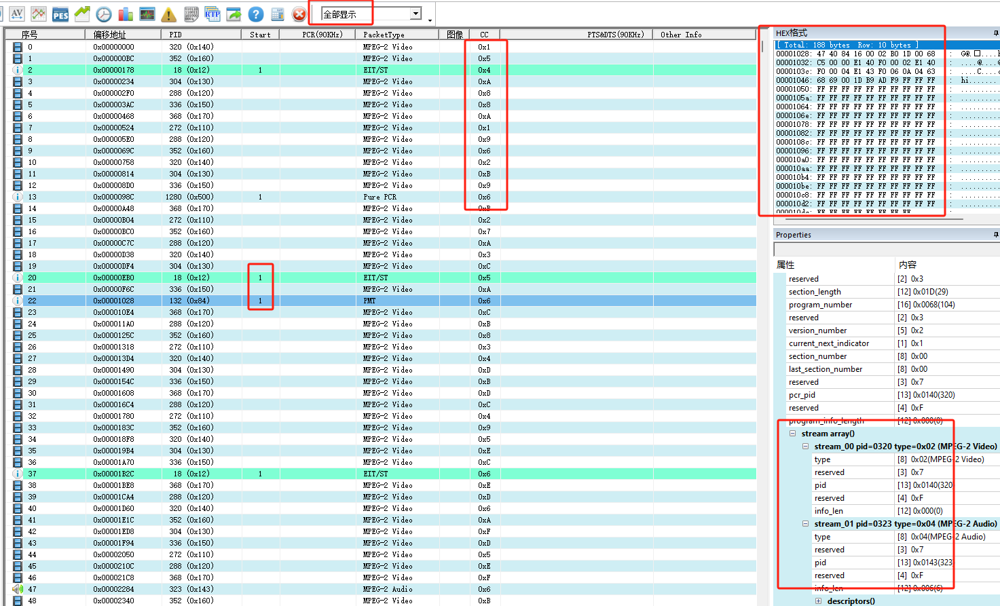

* PSI/SI过滤

    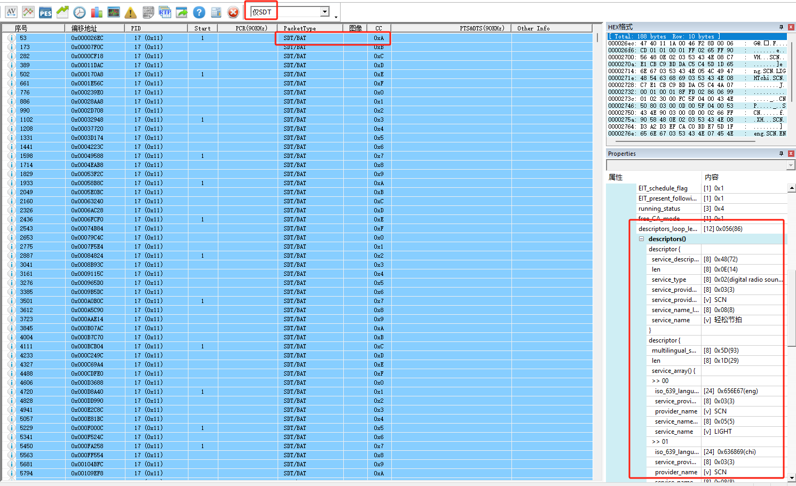

* 时间戳过滤

    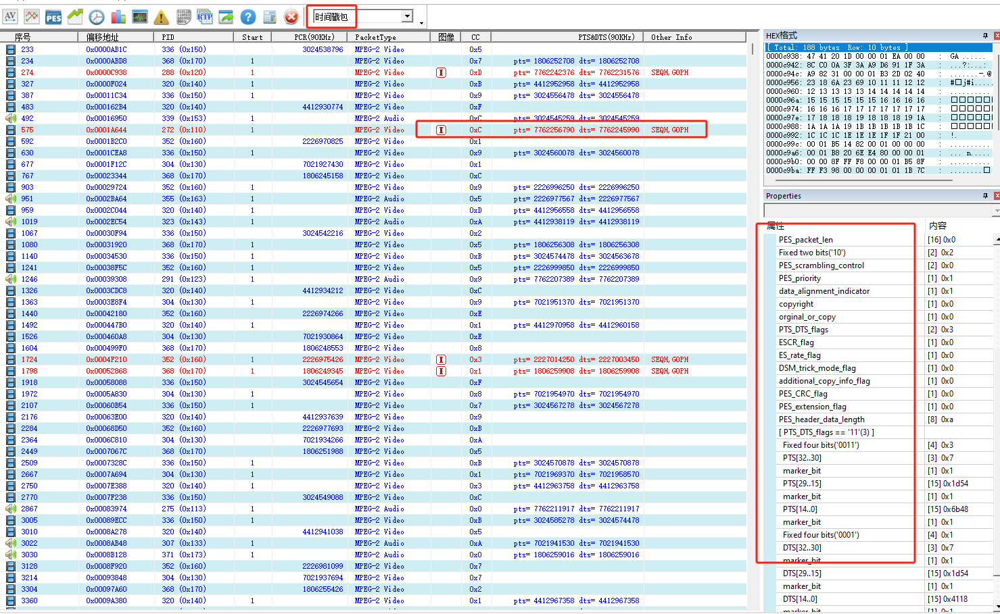

### 时间戳曲线

    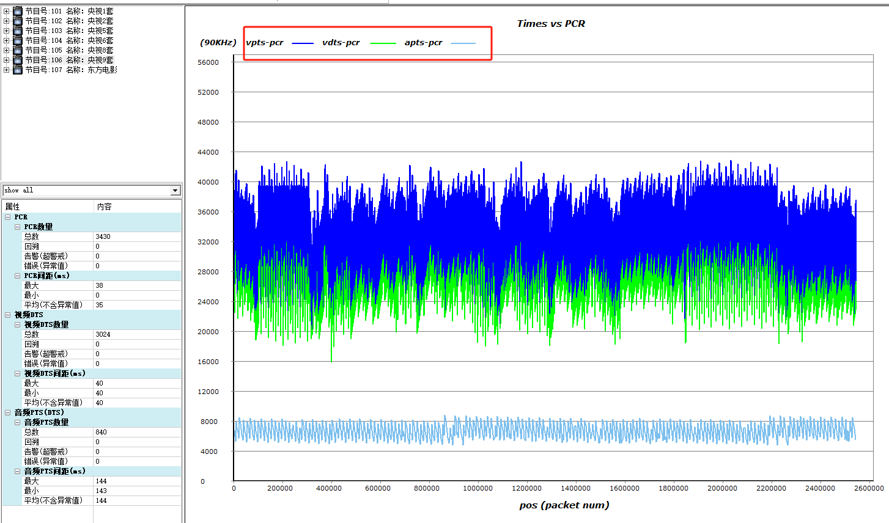

### ts流编辑

    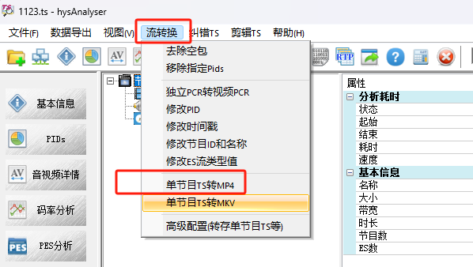

### 节目提取和转换

    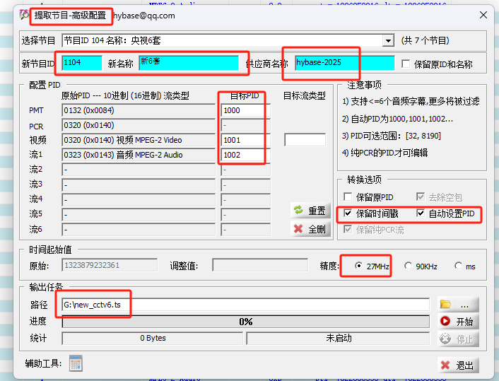

## 说明

  * 1）flvAnalyser 全免费 （除了flv分析外，还具备H264/H265/H266/AVS3等ES数据的分析和预览）

  * 2）hysAnalyser 大部分功能可免费使用。部分功能不免费，需要授权才能使用，需要的朋友可以参考文章结尾的授权说明！（微信：wybase）

  flvAnalyser综述 (Chinese): [https://cloud.tencent.com/developer/article/2344723]
  
  hysAnalyser综述 (Chinese): [https://cloud.tencent.com/developer/article/2517652]
  
  (知乎发布地址)[https://zhuanlan.zhihu.com/p/1902174484636631934]

## 联系和费用介绍

  * 知乎 (Chinese)：[https://www.zhihu.com/people/zymill]

  * 微信： wybase

  * Email: hybase@qq.com

  * 授权费用：**35 元(RMB) / 单台机器**

  * 授权方法

  1.入口
  

    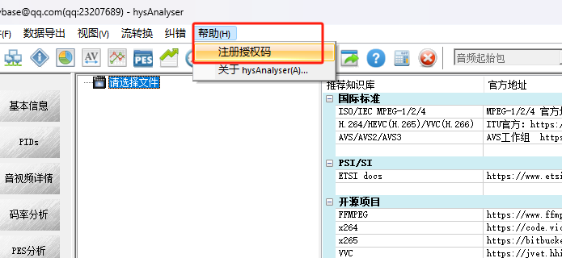

  
  2.采集机器码

    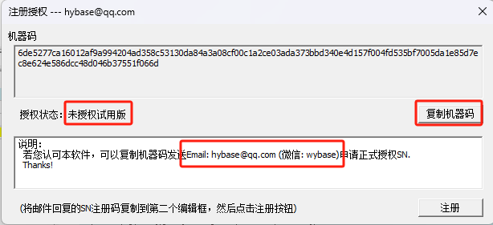

  
  3.注册

    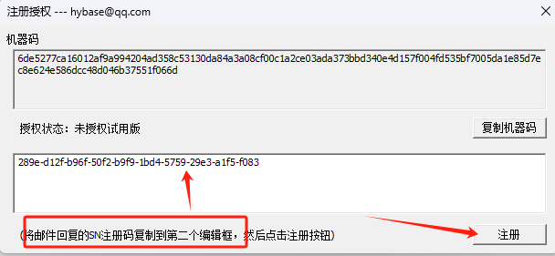

## 支持和赞赏

 * 如果您愿意支持本软件的长期发展，可以通过微信赞赏。谢谢！（若赞赏额超出注册费用，请告知作者，以便作者及时提供授权码）

    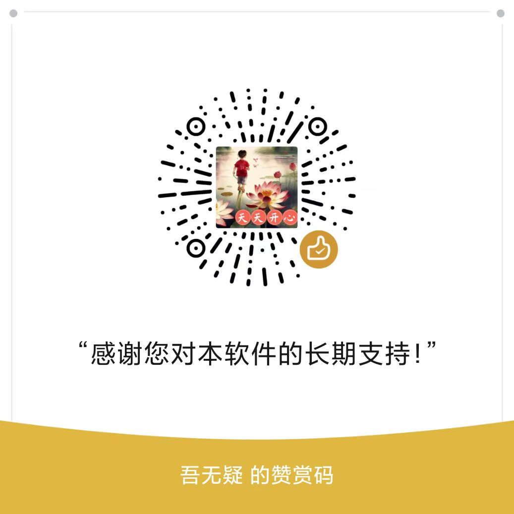

## Links

1. [MPEG-1/2/4](https://mpeg.chiariglione.org/)
2. [ITU官方](https://www.itu.int/rec/T-REC-H/en)
3. [AVS工作组](https://www.avs.org.cn/)
4. [ETSI](https://www.etsi.org/deliver/)

