# hysAnalyser 

  MPEG-TS analyser，仅支持中文

## 功能概述

  hysAnalyser是一款专业 MPEG-TS 数据分析和转换工具  ( Github：https://github.com/zymill/hysAnalyser )，功能列表如下

  * 1）MPEG-TS文件分析（PSI/SI，时间戳、码率、音视频同步，PES列表，音视频格式，RTP封装包列表等）

  * 2）HLS实时流接入（M3u8列表，分片缓存，下载码率）

  * 3）UDP实时流监测（实时码率曲线，PCR曲线，TR 101290统计, PSI/SI, 音视频详情）

  * 4）Audio/Video Codec List
    - Audio Codec：MP1/MP2/MP3/AAC/AC3/EAC3/**Audio Vivid(AV3A)**/**DRA**
	- Video Codec：**AVS1/AVS+/AVS2/AVS3**, MPEG-1/2/4，H.264/AVC、H.265/HEVC、**H.266/VVC**

  * 5）逐包分析
    - 单个TS包：追踪PCR，连续计数器，加密，调整字段等信息
	- 单个Section包 支持PAT/PMT/SDT/NIT/BAT/EIT/CAT/RST/TDT/TOT/DIT/SIT数据表解析, 可通过PID过滤和快速定位；
	- 单个PES包：追踪视音频 DTS、PTS、头部属性等关键信息

  * 6）ES分析和导出：支持按PES格式 或 ES格式导出数据；支持输出 H.264/HEVC/VVC/AVS1/AVS+/AVS2/AVS3 Nalunit/GOP/Picture List，更多 ES 详情可结合 flvAnalyser

  * 7）流播发功能：TS按PCR周期播发 UDP 或 RTP(over UDP)，可作为直播源使用。

  * 8）流转换功能：从多节目流按需配置参数提取节目流, 单节目TS转存MP4/MKV;

  * 9）分析结果数据导出，包括PCR，时间戳，码率，时间间距等内容；

  * 10）高级功能：流编辑修改PID，修改时间戳，修改界面名称，删除指定PID数据；

  * 11）定制化功能：非 MPEG-TS/DVB 标准数据支持 (需授权); 

（提示：hysAnalyser 部分增值功能需软件授权后才能激活使用，授权方法和费用请参考本文档末尾说明）

## 图示

### 基本信息

    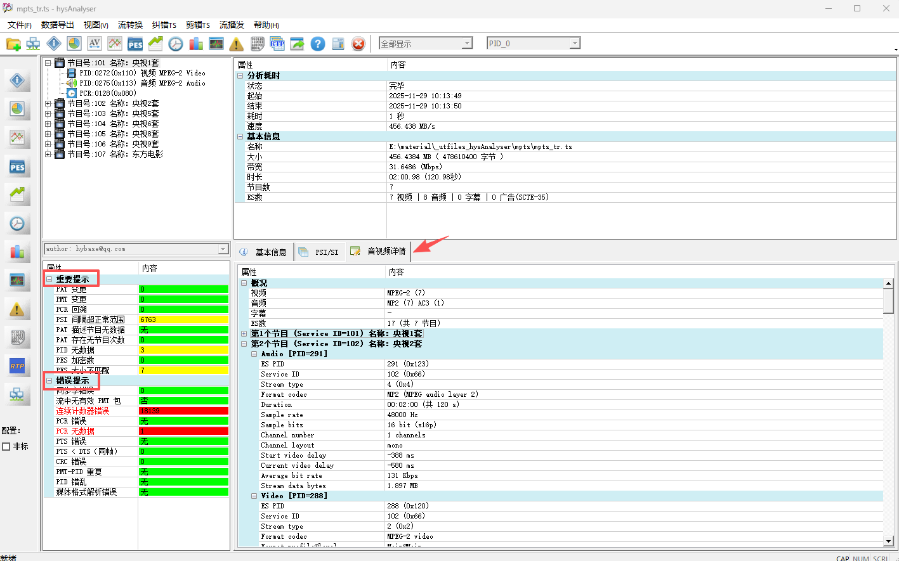

### 逐包分析

* 全量包

    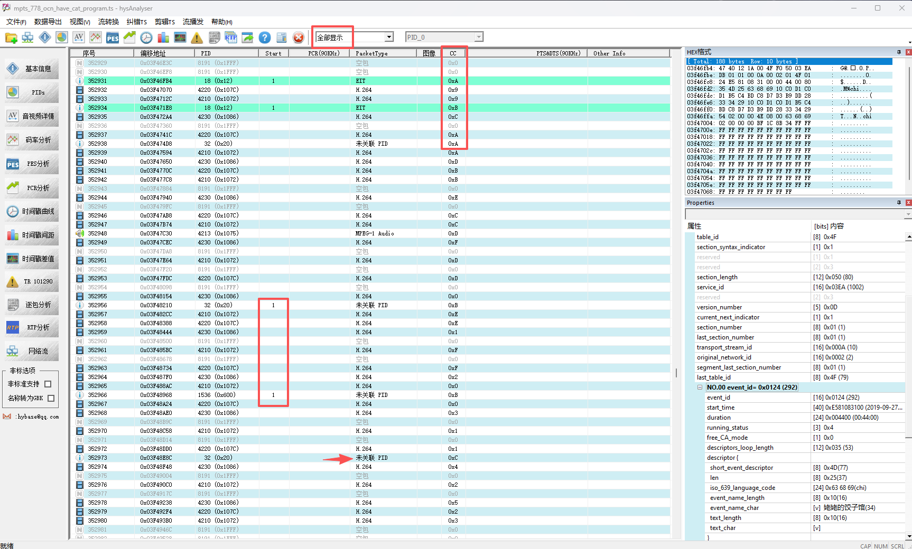

* PSI/SI过滤

    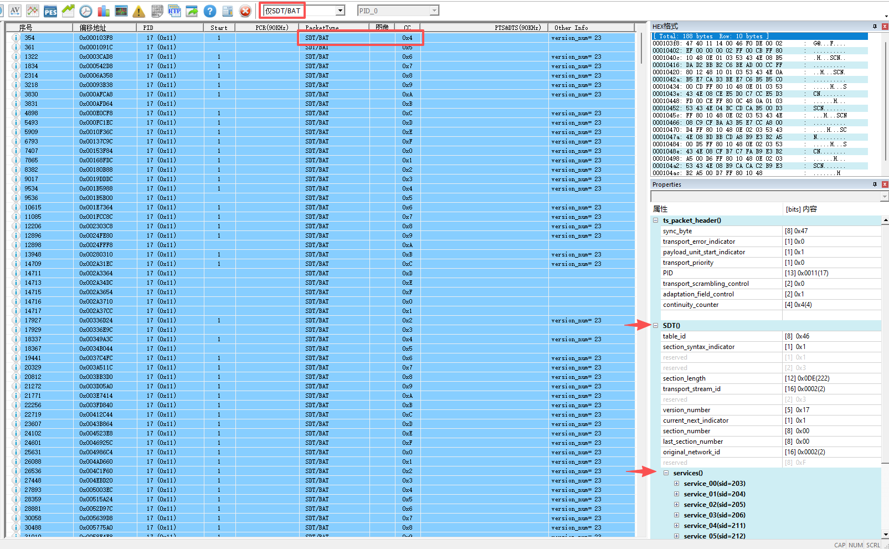

* 时间戳过滤

    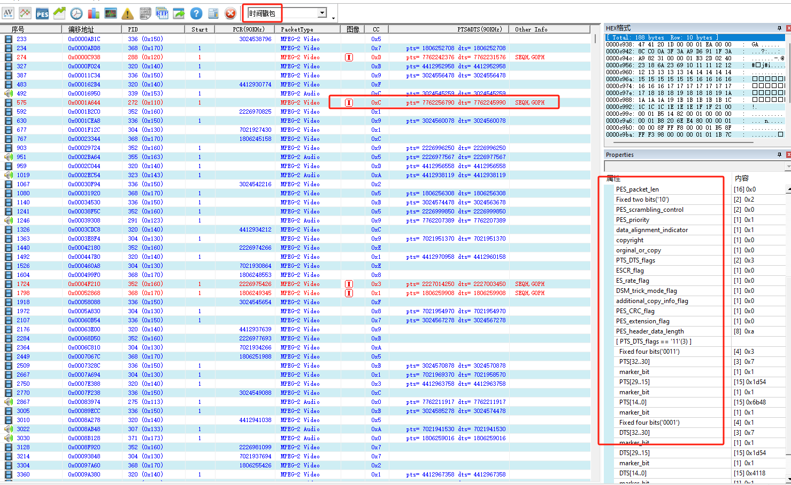

* 右键菜单：PID过滤和快速定位

    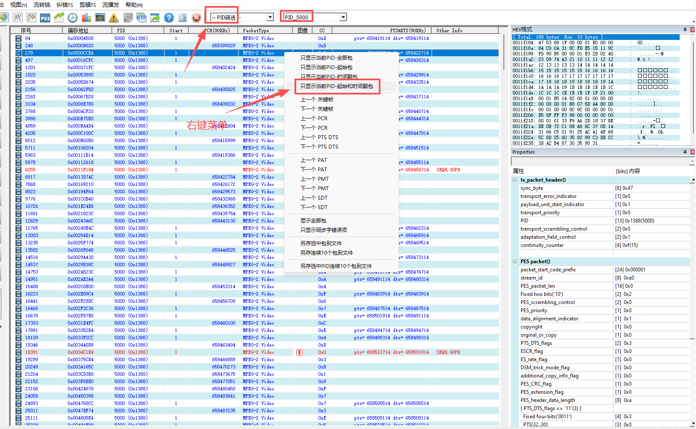

* 右键菜单：PID过滤

    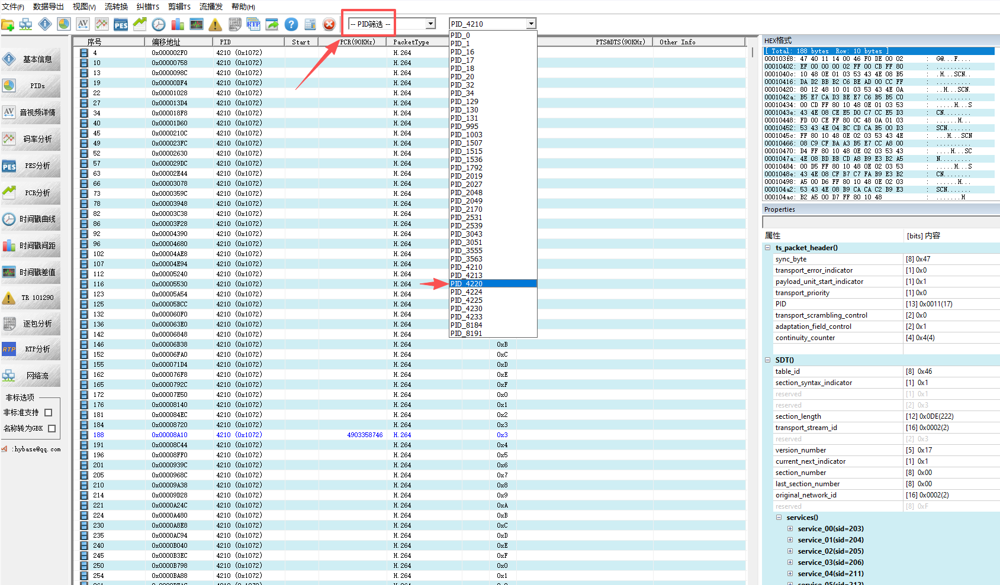

### 时间戳曲线

    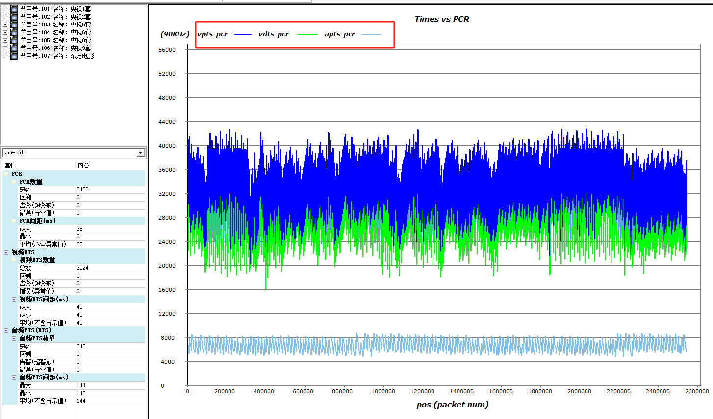

### ES流导出

    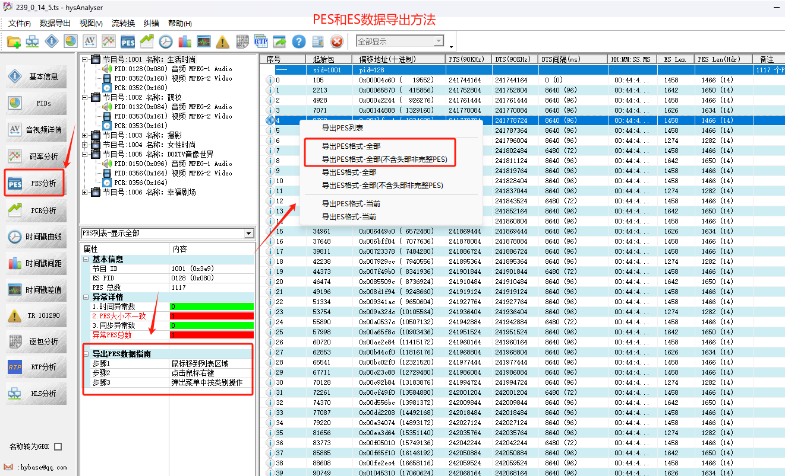

### ES数据分析

    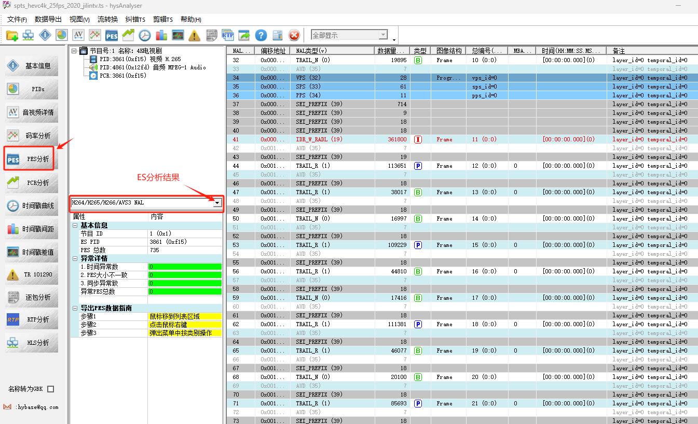

### ts流编辑

    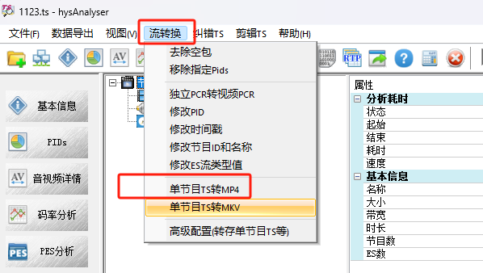

### 节目提取和转换

    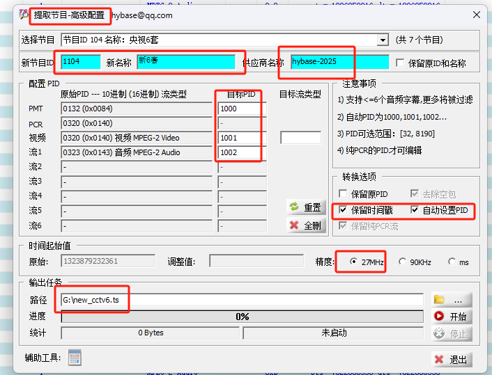

### ts流播发

    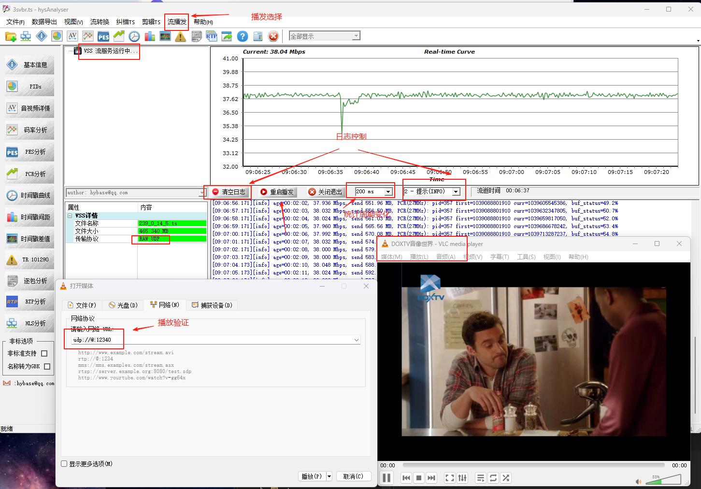

### ts实时流分析

    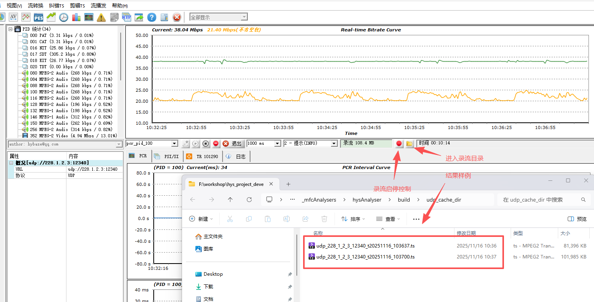

    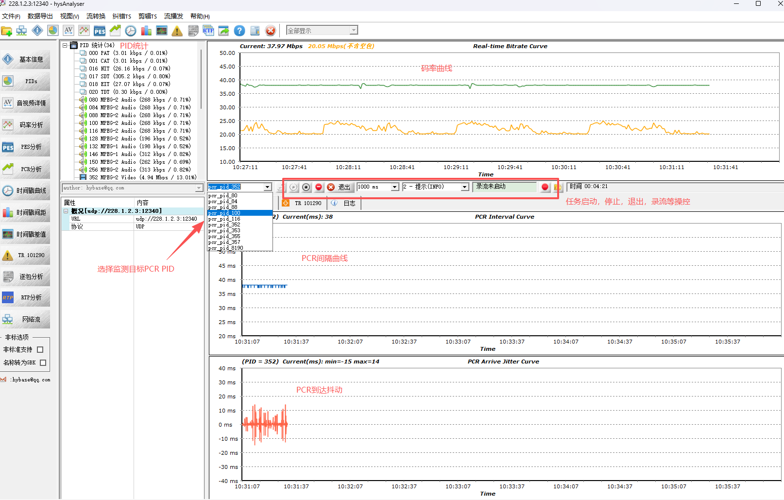

## 说明

  * 1）flvAnalyser 全免费 （除了 FLV 格式分析外，还具备 H264/H265/H266/AVS1/AVS+/AVS2/AVS3 等ES数据的分析和GOP视频预览）

  * 2）hysAnalyser 大部分功能可免费使用。部分功能需授权激活才能使用，可以参考文章末尾的授权说明！（微信：wybase）

  hysAnalyser综述 (Chinese): [https://cloud.tencent.com/developer/article/2517652]

  flvAnalyser综述 (Chinese): [https://cloud.tencent.com/developer/article/2344723]

  (知乎发布地址)[https://zhuanlan.zhihu.com/p/1902174484636631934]

## 功能详细说明 

  * TS流分析专栏 (腾讯云): [https://cloud.tencent.com/developer/column/105278]

  * hysAnalyser 一个特色 TS 流分析工具: [https://cloud.tencent.com/developer/article/2517652]

  * hysAnalyser 视频格式分析能力说明：[https://cloud.tencent.com/developer/article/2609350]

  * hysAnalyser UDP实时流分析使用指南: [https://cloud.tencent.com/developer/article/2589021]

  * hysAnalyser 从MPEG-TS导出ES功能指南: [https://cloud.tencent.com/developer/article/2521046]
  
  * hysAnalyser 特色的TS流编辑、剪辑和转存MP4功能指南: [https://zhuanlan.zhihu.com/p/1909374534462706463]
  
  * hysAnalyser 逐包分析MPEG-TS的功能指南: [https://zhuanlan.zhihu.com/p/1912444921148839675]

  * hysAnalyser 分析非标准数据的功能指南: [https://zhuanlan.zhihu.com/p/1919683425092233142]
  
  * hysAnalyser 支持菁彩视听双Vivid媒体信息解析: [https://cloud.tencent.com/developer/article/2537509]
  
  * hysAnalyser 支持文件转播UDP/RTP实时流功能: [https://cloud.tencent.com/developer/article/2553390]
 

## 授权联系和费用介绍

  * 知乎 (Chinese)：[https://www.zhihu.com/people/zymill]

  * 微信： wybase

  * Email: hybase@qq.com
  
  * 授权费用（提供两种模式）

    - 单台机器授权费用：**2027年1月1日前促销价 48 元 RMB (原价 68元 RMB) / 单台机器**   (永久授权，享有后续版本升级的所有新功能)

    - 双台机器授权费用：**2027年1月1日前促销价 78 元 RMB (原价108元 RMB) / 两台机器**   (永久授权，享有后续版本升级的所有新功能)
	
	补充：**2026年1月1日以前授权的老用户，如果需要新增设备，继续享有 35 元/单台机器优惠价格**

  * 授权方法

  1.入口
  

    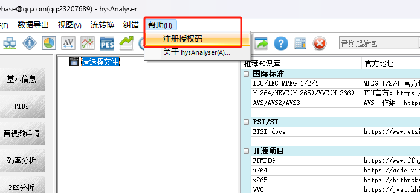

  
  2.采集机器码

    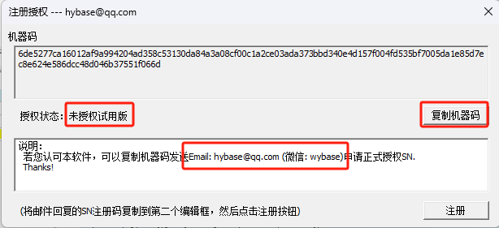

  
  3.注册

    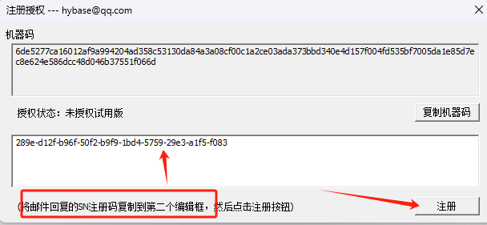

## 支持和赞赏

 * 如果您愿意支持本软件的长期发展，可以通过微信赞赏。谢谢！（若赞赏额超出授权注册费用，请告知作者，以便作者及时提供授权码）

    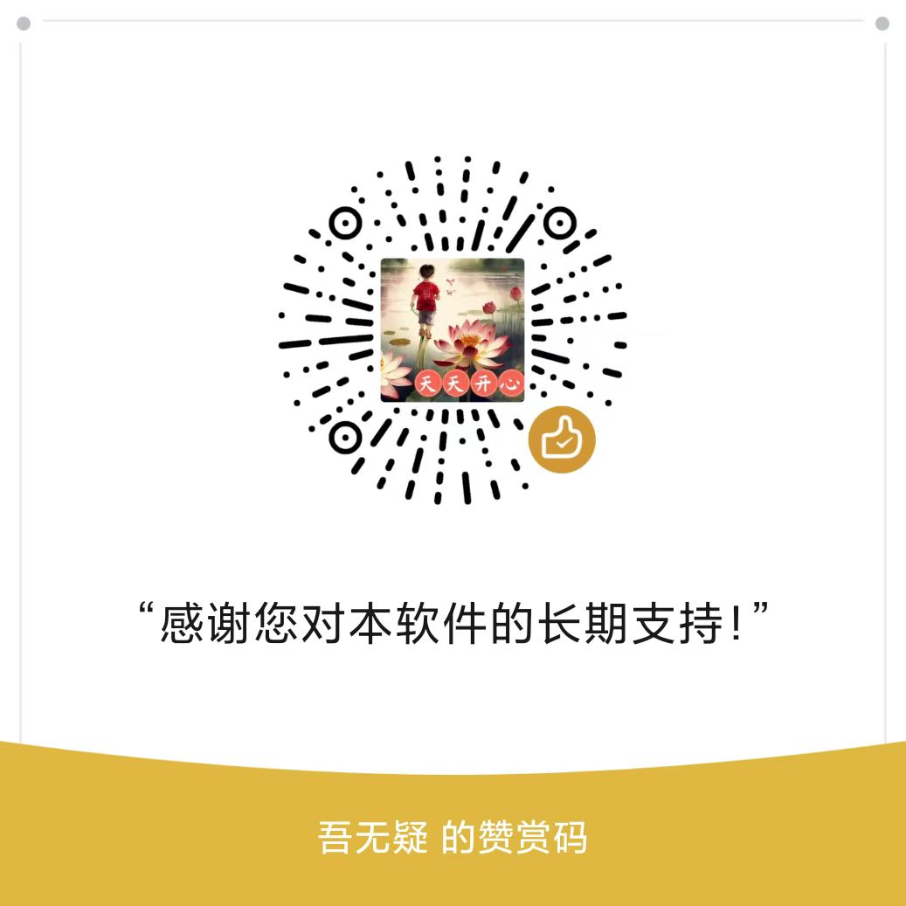

## Links

1. [TS流分析专栏](https://cloud.tencent.com/developer/column/105278)
2. [MPEG-1/2/4](https://mpeg.chiariglione.org/)
3. [ITU官方](https://www.itu.int/rec/T-REC-H/en)
4. [AVS工作组](https://www.avs.org.cn/)
5. [ETSI](https://www.etsi.org/deliver/)
6. [hysAnalyser 逐包分析使用说明(增加PID过滤)](https://cloud.tencent.com/developer/article/2592704)

